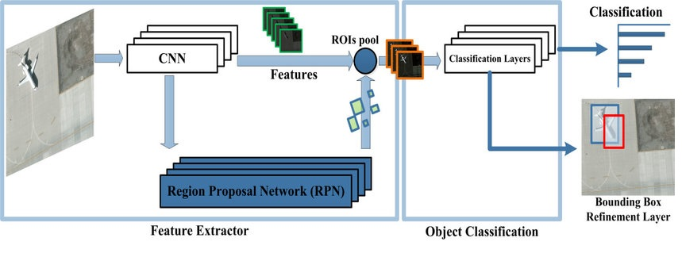
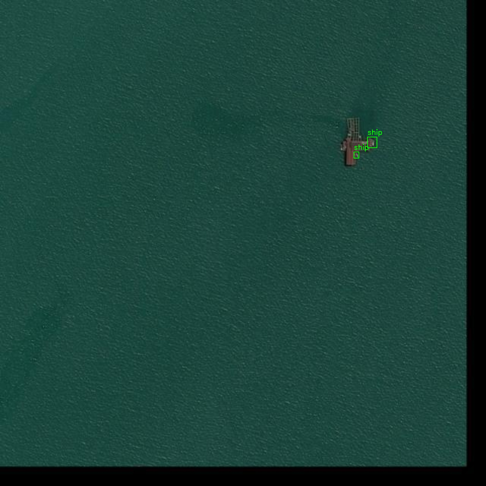
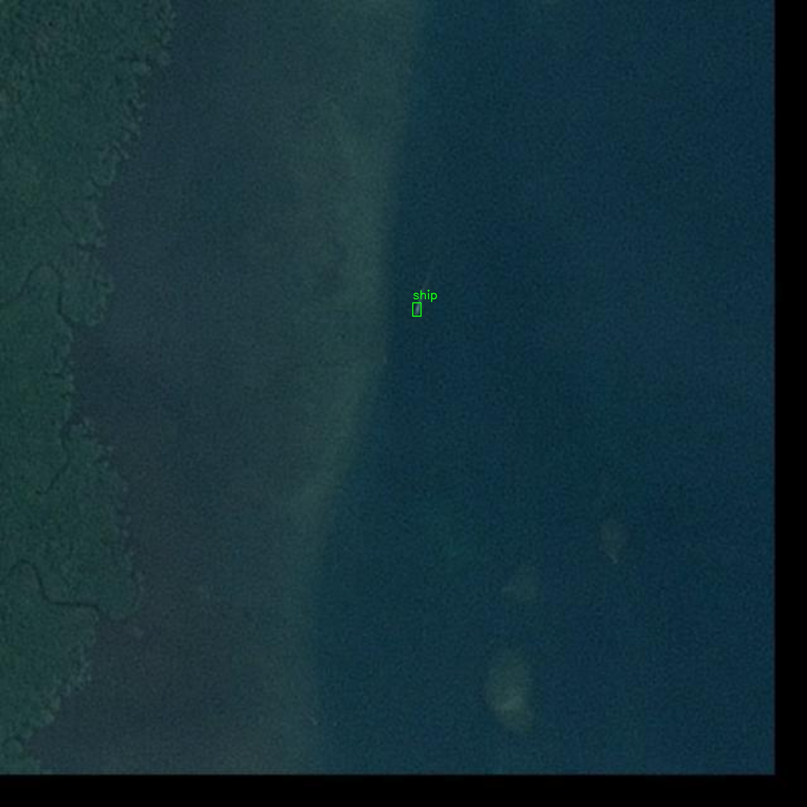
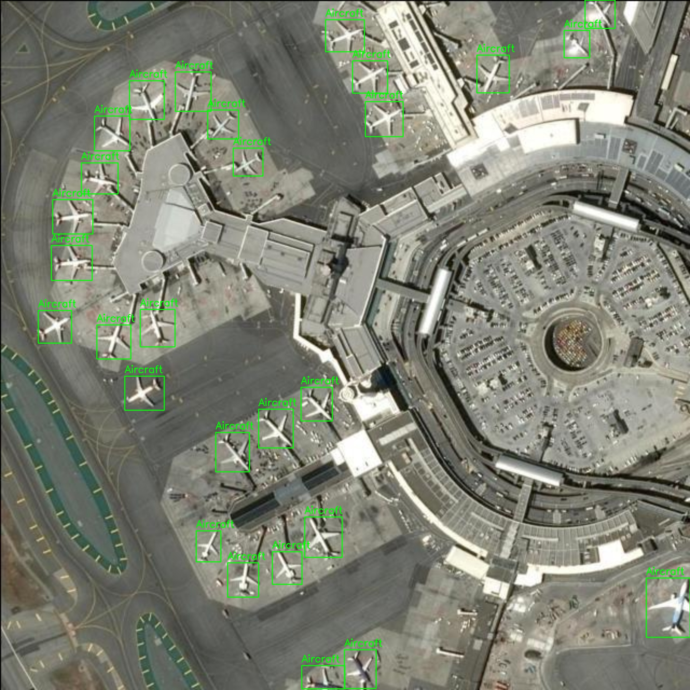
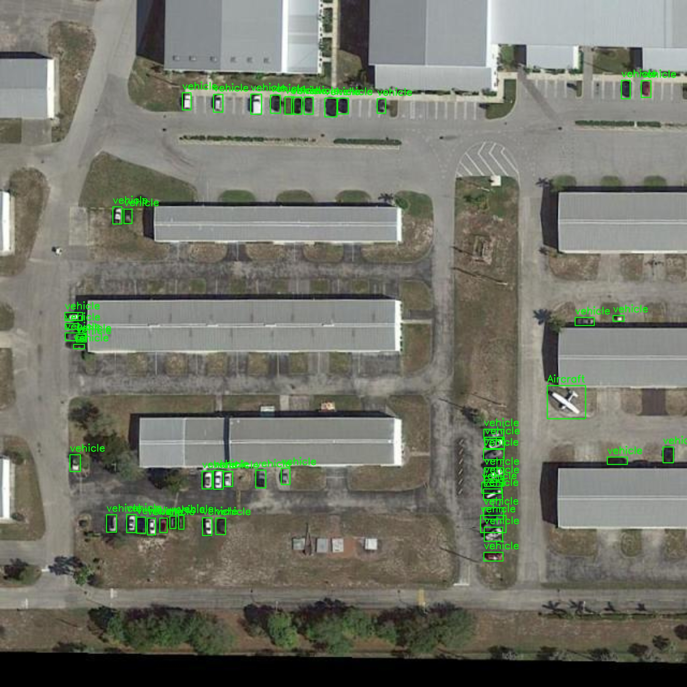
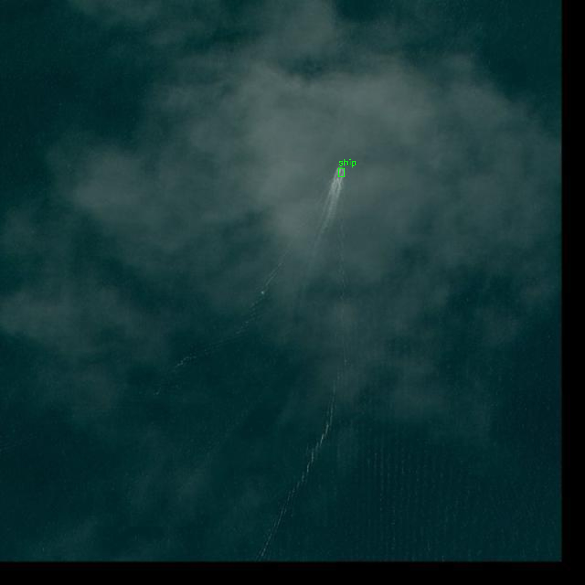
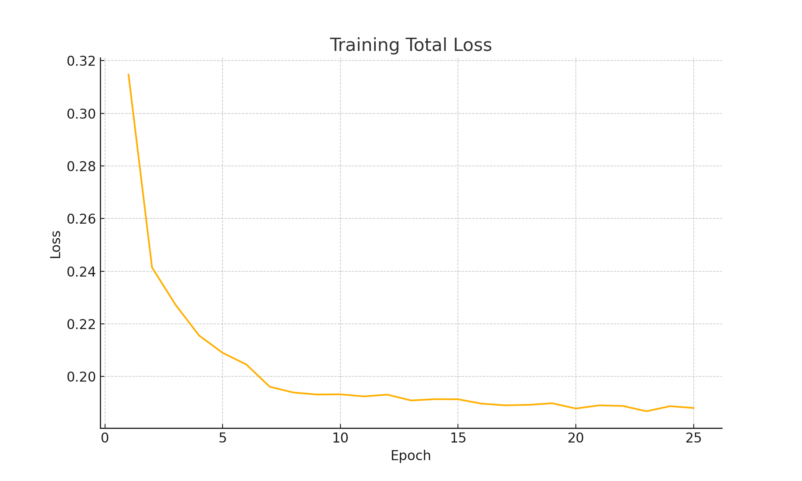
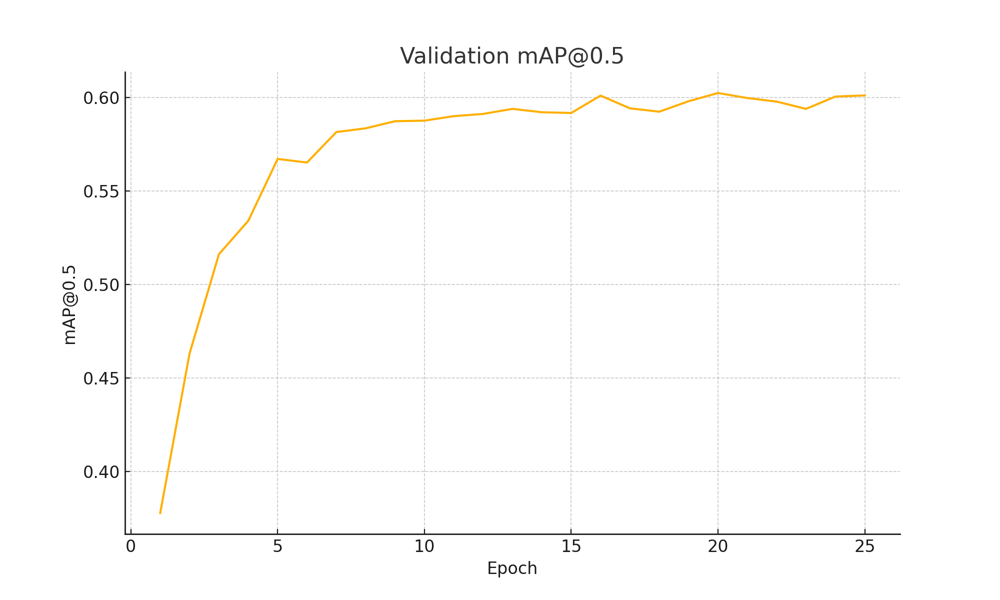

## 📖 Introduction

A deep-learning pipeline for object detection on the SkyFusion aerial imagery dataset. We use a Faster R-CNN model to detect objects of interest in high-resolution drone and satellite images.

* **Dataset**: COCO-format aerial images from Roboflow (SkyFusion)  
* **Task**: Object Detection (bounding box prediction)

---

## 🏗️ Architecture



We employ a two-stage detection architecture (Faster R-CNN) with the following components:

1. **Backbone**: ResNet-50 with Feature Pyramid Network (FPN) for multi-scale feature extraction  
2. **Region Proposal Network (RPN)**: Generates candidate object proposals  
3. **ROI Head**: Two parallel heads for classification and bounding-box regression  
4. **Losses**: Combination of classification loss, box regression loss, RPN box loss, and objectness loss

---

## 🛠️ Setup & Installation

**Prerequisites**

```bash
python >=3.8,<3.11
pip install -r requirements.txt
```

**Data**

Download and prepare the SkyFusion dataset (COCO) from Roboflow:

```bash
from roboflow import Roboflow
rf = Roboflow(api_key="YOUR_API_KEY")
project = rf.workspace("yihanren").project("skyfusion-z1ayi")
version = project.version(1)
dataset = version.download("coco")
```

---

## 📊 Predicted images

<table>
  <tr>
    <td></td>
    <td></td>
  </tr>
  <tr>
    <td></td>
    <td></td>
  </tr>
  <tr>
    <td></td>
    <td></td>
  </tr>
</table>

---

## 📊 Benchmarks & Metrics

<table>
  <tr>
    <td></td>
    <td></td>
  </tr>
</table>

---

## 📝 License
- **Code License**: This repository’s **code** is released under the MIT License.
- **Dataset License**: The SkyFusion dataset is provided under Roboflow’s standard terms and subject to their licensing (CC BY for public versions).

---

## 🤝 Contributing & Contact
Feel free to reach out by opening an issue or pull request. For direct questions, you may also contact:
* **Author**: Matin Gharehdaghi matingd.work@gmail.com
* **Acknowledgements**: Thanks to Roboflow for dataset hosting and the open-source detection community.

Feel free to open issues or PRs for improvements!
